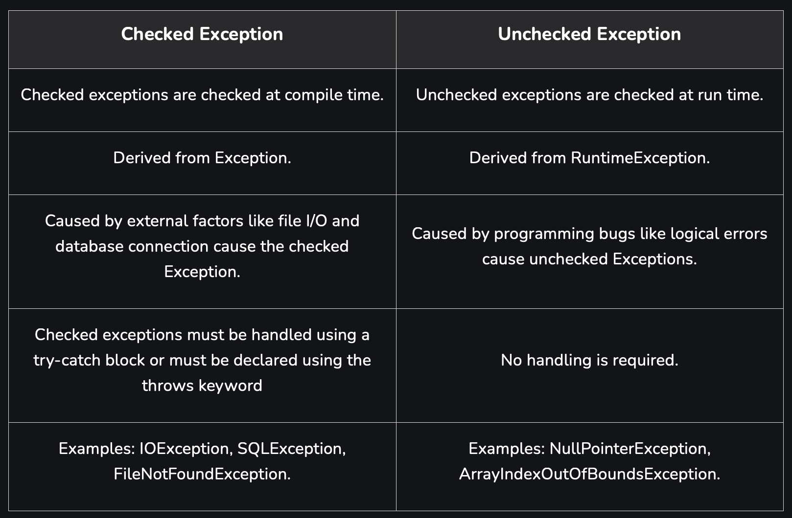

# Exception Handeling



---

---

## Java `finally` Block

The `finally` block in Java is used to execute cleanup code. It **almost always executes**, regardless of whether an exception occurs or not.

### Cases where `finally` **WILL execute**

#### No exception

```java
try {
    int a = 10 / 2;
}
finally {
    System.out.println("Finally executed");
}
```

#### Exception occurs and is caught

```java
try {
    int a = 10 / 0;
}
catch (ArithmeticException e) {
    System.out.println("Exception caught");
}
finally {
    System.out.println("Finally executed");
}
```

#### Exception occurs but not caught

```java
try {
    int a = 10 / 0;
}
finally {
    System.out.println("Finally executed");
}
```

#### `return` statement in `try`

```java
static int test() {
    try {
        return 10;
    }
    finally {
        System.out.println("Finally executed before return");
    }
}
```

---

### **Cases where** `finally` **WILL NOT execute**

#### `System.exit()` is called

```java
try {
    System.exit(0);
}
finally {
    System.out.println("This will NOT execute");
}
```

#### Infinite loop in `try`

```java
try {
    while (true) { }
}
finally {
    System.out.println("Never executed");
}
```

---

## Key Points

* `finally` executes **whether exception occurs or not**
* `finally` executes **before return**
* `finally` does **not execute** if JVM terminates explicitly or abnormally
* Most common reason: `System.exit()`

> The `finally` block will not execute if the JVM terminates abnormally or explicitly using `System.exit()`.

---

---

## Java `throws` Keyword

The `throws` keyword in Java is used in a **method declaration** to specify that the method may pass an exception to its **calling method** instead of handling it internally. It is mainly used for **checked exceptions**.

### Syntax:

```java
returnType methodName() throws ExceptionType;
```

### Example:

```java
import java.io.*;

class Demo {
    static void readFile() throws IOException {
        FileReader fr = new FileReader("data.txt");
    }

    public static void main(String[] args) {
        try {
            readFile();
        }
        catch (IOException e) {
            System.out.println("Exception handled");
        }
    }
}
```

### Key Points:

* Used only in **method signature**
* Passes exception handling responsibility to the caller
* Caller must **handle** or **re-declare** the exception
* Mainly used for **checked exceptions**

### One-line Exam Answer:

> The `throws` keyword declares exceptions that a method may pass to its calling method.

---

---

## Difference Between `throw` and `throws` in Java

| throw                                              | throws                                         |
| -------------------------------------------------- | ---------------------------------------------- |
| Used to**explicitly throw an exception**     | Used to**declare exceptions**            |
| Written**inside a method body**              | Written in**method declaration**         |
| Throws**only one exception at a time**       | Can declare**multiple exceptions**       |
| Used to create**custom exceptions**          | Used to pass exception handling responsibility |
| Followed by an**exception object**           | Followed by**exception class names**     |
| Used for**checked and unchecked** exceptions | Mainly used for**checked** exceptions    |

### Example:

```java
if (age < 18) {
    throw new ArithmeticException("Not eligible");
}
```

```java
void readFile() throws IOException {
    FileReader fr = new FileReader("data.txt");
}
```

> `throw` actually throws an exception, while `throws` declares that an exception may occur.

---

---
