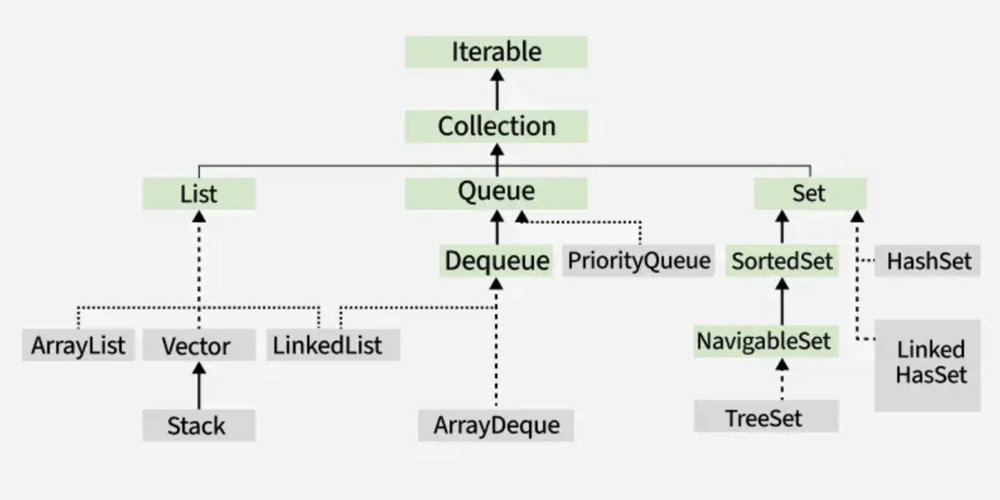

# Interfaces



---

---

## List Iterator 

`ListIterator` is a specialized iterator used **only with List** implementations. It allows **bidirectional traversal** and provides more operations than `Iterator`.

### Example:

```java
List<String> list = new ArrayList<>();
ListIterator<String> it = list.listIterator();

```

### Key Points:

- Works only with `List`
- Supports forward and backward traversal
- Can add, remove, and modify elements
- Extends `Iterator`

### One-line Exam Answer:

> ListIterator is used to traverse a List in both directions and modify elements during iteration.

---
---

